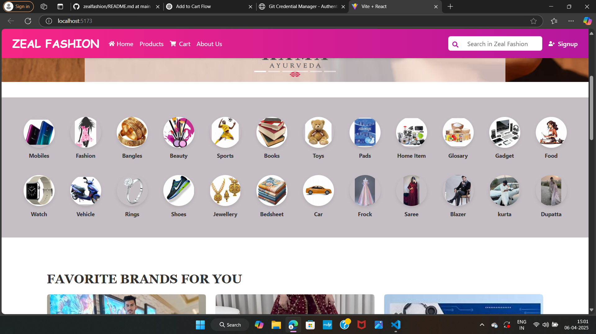
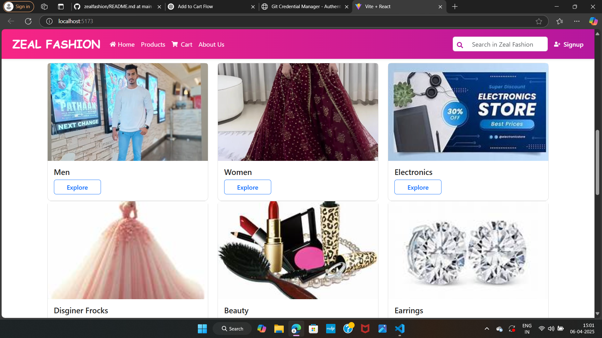
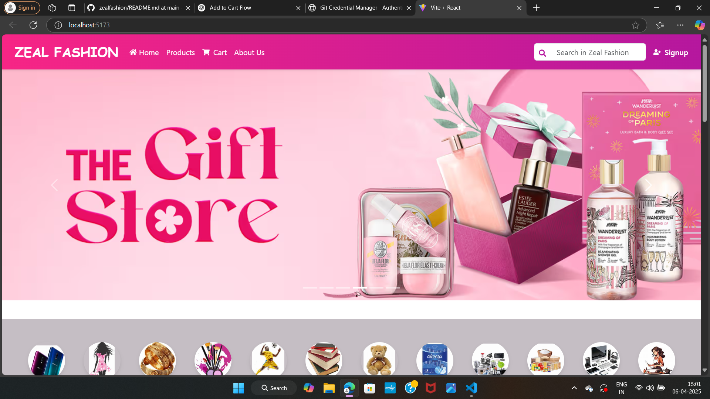

<<<<<<< HEAD
# React + Vite

This template provides a minimal setup to get React working in Vite with HMR and some ESLint rules.

Currently, two official plugins are available:

- [@vitejs/plugin-react](https://github.com/vitejs/vite-plugin-react/blob/main/packages/plugin-react/README.md) uses [Babel](https://babeljs.io/) for Fast Refresh
- [@vitejs/plugin-react-swc](https://github.com/vitejs/vite-plugin-react-swc) uses [SWC](https://swc.rs/) for Fast Refresh

## Expanding the ESLint configuration

If you are developing a production application, we recommend using TypeScript and enable type-aware lint rules. Check out the [TS template](https://github.com/vitejs/vite/tree/main/packages/create-vite/template-react-ts) to integrate TypeScript and [`typescript-eslint`](https://typescript-eslint.io) in your project.
=======
# zealfashion
e commerce website
>>>>>>> b64a0458858655a894bd99ca4588f7bbc1a2cfd6
>>>>>>> 
  # Demo 
  # Home Page

#  Zeal Fashion – E-Commerce Website (MERN Stack)

**Zeal Fashion** is a full-stack e-commerce web application built using the **MERN stack** (MongoDB, Express.js, React.js, Node.js). This platform allows users to browse products, add them to a cart, and place orders with a smooth multi-step checkout process.

---

## 🧩 Tech Stack

- **Frontend**: React.js, JSX, Tailwind CSS (or plain CSS)
- **Backend**: Node.js, Express.js
- **Database**: MongoDB
- **Other Tools**: Axios, React Router, Postman (for API testing)

---

## ✨ Features

### 🌐 Frontend

- Responsive design with reusable components
- **Home Page** – Landing page for the website
- **Products Page** – View all products
  - Add to Cart functionality (stores in MongoDB)
- **Cart Page** – Displays user’s cart items from DB
- **Authentication** – Signin and Signup forms

### ⚙️ Backend

- REST API built with Express.js
- MongoDB used for:
  - Storing users, products, and cart data
- Routes for:
  - `POST /auth/signup`
  - `POST /auth/signin`
  - `POST /cart/add`
  - `GET /cart/:userId`

---

## 🗂️ Project Structure

### 📁 Frontend – `client/`

client/ ├── components/ │ ├── Navbar.jsx │ ├── Footer.jsx │ └── ProductCard.jsx ├── pages/ │ ├── Home.jsx │ ├── Products.jsx │ ├── CartPage.jsx │ ├── Signin.jsx │ ├── Signup.jsx │ └── BuyNowSteps/ │ ├── Address.jsx │ ├── Payment.jsx │ └── ConfirmOrder.jsx ├── App.jsx └── index.js

### 📁 Backend – `server/`

server/ ├── controllers/ │ ├── authController.js │ ├── cartController.js │ └── orderController.js ├── models/ │ ├── User.js │ ├── Product.js │ ├── Cart.js │ └── Order.js ├── routes/ │ ├── authRoutes.js │ ├── cartRoutes.js │ └── orderRoutes.js ├── config/ │ └── db.js ├── server.js └── .env

---

## 🔌 Installation & Setup

### 1. Clone the Repository

git clone https://github.com/your-username/zeal-fashion.git
cd zeal-fashion

### 2. Setup Backend
cd server
npm install
# Create a .env file and add your MongoDB URI and JWT_SECRET
npm run dev
### 3. Setup Frontend
cd ../client
npm install
npm run dev

## 📬 API Endpoints (Backend)
Method	Endpoint	Description
POST	/auth/signup	Register a new user
POST	/auth/signin	Authenticate user
POST	/cart/add	Add product to cart
GET	/cart/:userId	Get user’s cart
POST	/order/buy-now	Place a new order

